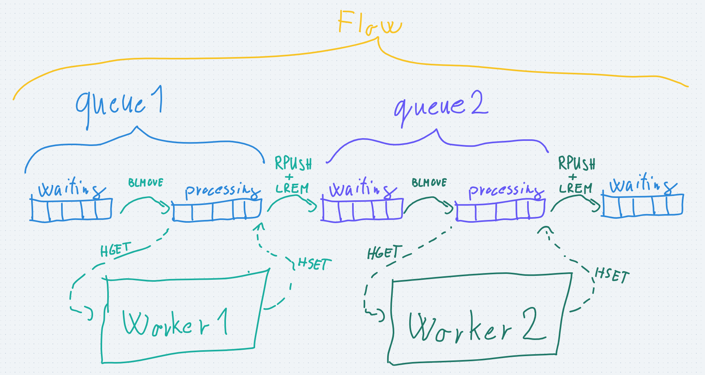

# Guild Queues

Redis-based distributed job queue library for Guild.xyz's backend infrastructure.

<p align="center">
  
</p>

## Installation

```
npm install @guildxyz/queues
```

## Example usage

```typescript
import { AccessFlow } from "@guildxyz/queues";

// create the flow instance
const accessFlow = new AccessFlow({
  redisClientOptions: { url: config.redisHost },
  logger,
});

// set up the worker
accessFlow.createChildWorker("manage-reward:discord", async (job) => {
  const success = await handleAccessEvent(job);
  return { success };
});

// start
accessFlow.startAll();
```

---

## How it works

### Why redis?

- most message/job queue implementations don't support exactly-once processing
- we don't want another "magic" technology like Prisma
- we are familiar with redis
- no vendor lock-in
- it's relatively easy to switch from

### How can we implement job queues in redis?

- redis implements the [list](https://redis.io/docs/data-types/lists/) data structure and has commands ([LMOVE](https://redis.io/commands/lmove/) or [BLMOVE](https://redis.io/commands/blmove/)) to atomically remove the first/last element of a list and add this element to another list
- these commands are atomic, which guarantees that
  - the element will only move to exactly one new list
  - the element will be removed from the first array, so no inconsistency can happen
- BLMOVE is the blocking variant of LMOVE which means it will wait until an element is present in the first array, so we don't need to check it periodically
- basically we will have two queues (redis lists)
  - the **waiting** queue, which contains the jobs waiting for execution
  - the **processing** queue, which contains the jobs that are under execution


- conclusion: we can mark a job for execution and mark it exactly once and also avoid any kind of inconsistencies

### Where to store the job's parameters / result?

- we can store the job's data serialized in the queues (lists) and deserialize them when we need to use their values, however this would caused several problems (we will see soon why)
- so we will store the job's data in another redis data structure, in a [hash](https://redis.io/docs/data-types/hashes/) which is basically an object/map containing key-value pairs
- the hash will contain the params and later the result of the job, and the queues (lists) will only pass the job's ids among each other
- so first we generate an ID for the job, save the job's data to a hash with the [HSET](https://redis.io/commands/hset/) command and put the job's ID to the waiting queue with the [RPUSH](https://redis.io/commands/rpush/) command
- then when the job moves to the processing queue we can access the job's parameters buy fetching the hash's fields with the [HGET](https://redis.io/commands/hget/) command
- finally when the job is done we save the job's result to the hash with the HSET command

#### Example

Putting a job into the queue:

- Put the job to a set<br>
  `> HSET job:123 userId 62 guildId 1985`<br>
  The `job:123` hash will be:

  ```
  {
    userId: 62,
    guildId: 1985
  }
  ```

- Put the job's id to the waiting queue<br>
  `> RPUSH queue:waiting job:123`

  The `queue:waiting` will be `[job:123]`<br>
  and the `queue:processing` will be `[]`

Processing a job:

- Mark the job as processed<br>
  `> BLMOVE queue:waiting queue:processing LEFT RIGHT`<br>
  The `queue:waiting` will be `[]`<br>
  and the `queue:processing` will be `[job:123]`
- Get the job's data<br>
  `> HGET job:123 userId guildId`<br>
  Will return:
  ```
  {
    userId: 62,
    guildId: 1985
  }
  ```
- _now the job is executed with the parameters_
- Save the result<br>
  `> HSET job:123 access true`<br>
  The `job:123` hash will be:

  ```
  {
    userId: 62,
    guildId: 1985
    access: true
  }
  ```


- all these commands have the amortized [time complexity](https://www.freecodecamp.org/news/big-o-cheat-sheet-time-complexity-chart/) of `O(1)` which basically means that the command will almost always complete in some constant time and won't get slower as the list grows, so we expect it to stay pretty fast even if the load is bigger

- conclusion: we can now store a job separately from the queues and retrieve/modify it's value

### What happens when a job fails, how will this prevent us from losing ongoing jobs?

- When we move a job to the processing queue we know that it's under execution and expect a result soon. If there's no result, we assume that the job failed and retry it or mark it as failed.
- So we need a timeout which indicates how much time we wait until we mark a job as failed. Redis natively supports key expiration so we will save a key (a "lock") whenever a job is being processed and periodically check if the job is done and whether there's a "lock" for it. If the job is not completed and there's no "lock" key for it, we assume that the job is failed and proceed.
- Saving the lock key is done by the [SET](https://redis.io/commands/set/) command<br>
  `> SET job:123:lock blabla EX 60`<br>
  The value is not important yet, we just save the job:123:lock key for 60 seconds.
- For the periodical checking first we need to list the jobs that are processed at the moment:<br>
  `> LRANGE queue:processing 0 -1`<br>
  The [LRANGE](https://redis.io/commands/lrange/) command will list a range of a list, and the 0 and -1 parameters mean the first and the last item, so all the items will be fetched.<br>
  Then we can easily check if a key is exists with the [GET](https://redis.io/commands/get/) command<br>
  `> GET job:123:lock`


- unfortunately we have to make a compromise here, the LRANGE command has the time complexity of O(N), which means it gets slower as the list grows

- conclusion: no job is lost, if the execution fails, we will know about it

### What happens when a job is done? How to execute a series of jobs?

- The motivation to create this lib was to put our access-check / job flow into queues instead of using stateless REST requests for communication or using some third-party library's queueing system (e.g. discord.js)
- So we want to create an abstraction for flows, sequences of jobs
- We can modify our current setup by putting a completed job's id to the next queue and basically creating a pipeline of jobs.
- One might think that moving a completed job from the current processing queue to the next waiting queue would easily solve this problem, but unfortunately that's not the case, because BLMOVE can only move the first/last element of a list, and if there're multiple jobs under execution we can't be sure that the completed job is the last in the list


- Example why this will not work:

  - we create some jobs<br>
    waiting: `[a, b, c, d, e]`
  - we start executing the next job: a<br>
    waiting: `[b, c, d, e]`<br>
    processing: `[a]`
  - we start executing the next job: b<br>
    waiting: `[c, d, e]`<br>
    processing: `[a, b]`
  - we start executing the next job: c<br>
    waiting: `[d, e]`<br>
    processing: `[a, b, c]`
  - the execution of job b is finished, but we can't move it to another list with BLMOVE because it's in the middle of the list :(

- So we need to move a specific element from the processing queue to another queue. Unfortunately redis does not have a native command to do this, so we will use two commands.
  - [LREM](https://redis.io/commands/lrem/), to remove a specific element from the list
  - RPUSH, to put the job to the next waiting queue
- Because these are two separate commands and redis does not support [ACID](https://www.ibm.com/docs/en/cics-ts/5.4?topic=processing-acid-properties-transactions) transactions we will have a tiny chance to cause inconsistency.<br>
  The most we can do is
  - we first RPUSH the job to the next queue, then remove it from the current one, so in the worst case it will be executed twice, but won't be lost
  - use [redis transactions](https://redis.io/docs/manual/transactions/#:~:text=Redis%20Transactions%20allow%20the%20execution,are%20serialized%20and%20executed%20sequentially.) which does not guarantee atomic execution but will make sure that no other command will be executed in the middle of the transaction, so we minimize the chance of making inconsistencies


- unfortunately LREM also has the time complexity of O(n)
- conclusion: the completed jobs can be forwarded to the next queue, so we are able to create a pipeline of jobs which we will refer to as flows

### Abstraction

#### Queue

- we saw that all we need is a pair of redis lists to represent a basic job queue in redis
- we will have a Queue class which will represent this structure
  - it will have a name (e.g. access-check)
  - it will store the information about how it is stored in redis: the prefix (e.g. `queue:`), the name of the waiting and processing queues (e.g. `queue:access-check:waiting`), etc.
  - and it will also store some basic information about what fields of the job's hash should be fetched as the job's parameters
- **so basically a queue is a part of the flow / job pipeline**
- for example the access-check (when the core asks the gate for the accesses of a given user and a role) will be 1 Queue

#### Flow

- A flow is a job pipeline, contains the information about
  - the queues it consists of
  - what job should be executed after one is finished (=what queue comes after another)
  - **a job's state (the information stored in redis hashes) is also defined by the flow, because the same hash will be used throughout the flow**
    - the Flow class is responsive for creating a new job and fetching it (for monitoring purposes)

#### Worker

- The jobs in the waiting queue are moved to the processing queue and executed then the result is saved.
- The entity that does the above is called the worker, it basically
  - checks the waiting queue it belongs to
  - marks a job for execution,
  - fetches the job's data
  - calls the provided WorkerFunction with the job's data (= execute the job)
  - saves the job's result
  - puts the job's ID to the next queue
- It stores
  - the flow it belongs to
  - the queue it belongs to
  - the WorkerFunction which is the definition of the execution

Note: the redis hash where the job's data is stored will be called the _state of the job_ or the _state_ to make is shorter



Example: the access/join flow https://whimsical.com/access-queue-TGADUnGjaVLEV139AoPxdZ@VsSo8s35Wy8ndXd5AHDbf5

### Implementation

- In the implementation all the above is implemented as generic classes (base directory), and the specific flows/queues/workers can inherit from them (e.g. the access flow's classes are in the access directory)

#### UML diagram


Note: the newest version can be fount here: https://whimsical.com/access-queue-TGADUnGjaVLEV139AoPxdZ@3CRerdhrAwHFFHCDHoQsxnuu

#### Redis key names

- `queue:<queueName>:<stage>`
  - stage can be `waiting` or `processing`
  - list for the waiting/processing jobs
  - example: - `queue:update-membership:processing`
- `lock:<queueName>:<jobId>`
  - lock for a job in a queue
  - contains the worker's id
  - example: `lock:update-membership:aa27f46a-0cb0-43ff-aee9-13046101f1a7`
- `job:<flowName>:<property>`
  - lookup key for the job
  - contains the job's id
  - example: `job:access:userId:62`
- `job:<flowName>:<jobId>`
  - the job hash
  - example: `job:access:aa27f46a-0cb0-43ff-aee9-13046101f1a7`
  - special keys in job hash:
    - `done`: true if the job is not running anymore (succeed or failed)
    - `completed-queue`: the last queue which succeeded
    - `children:<parentQueueName>:params`
      - array of params of child jobs to create
      - it will be used by the parent queue
    - `children:<parentQueueName>:jobs`
      - array of child job keys
      - these keys are checked by the parent queue periodically
- child queues and jobs names are composed by concatenating the parent queue name and the child name, separated by a column
  - example: `manage-reward:discord` (`manage-reward` parent queue, `discord` child)

---

### Everybody gangsta until the flow splits into multiple sub-queues

- Unfortunately the join flow has a part where it gets more complicated than just having one queue after another. After the access-check and the membership updates are done we need to give platform accesses to the user in different platforms. Here the flow basically splits into multiple sub-queues, which we will call child-queues.


- This introduces complex logic, mainly because the

  - parent queue have to start multiple child-jobs instead of one next job
  - the child jobs may need info about their parents
  - when all the child jobs are finished the next job should be started

- We have multiple options how we want to implement the parent-child relationship
- Based on the facts that

  - we likely won't need complex, multi-level hierarchies
  - the child jobs are atomic, so they won't have next queues, only the parent

  I decided to store the child job's parameters and results in the parent job's state. **So the child jobs uses their parent's state, instead of having their own.**

- A ParentWorker in addition to its regular Worker duties will

  - save the child jobs' data to the state
  - generate id for the child jobs and put them in the child queues

- A ChildWorker will

  - instead of fetching its own state, it will fetch its parent's state's field which stores the child job
  - instead of saving the result to its own state, it will save the result to its parent's state
  - instead of putting the jobId to a next queue, it will check how many child jobs are (of this child group) and how many of them are complete, and if all of them are complete, it will start the job

- There is a chance we have to rethink this logic, because it might not be flexible enough, for other use-cases. WIP

---

### Handling Rate limits

WIP
https://whimsical.com/access-queue-TGADUnGjaVLEV139AoPxdZ@VsSo8s35WxWyF2SRXAgTFy

### Advanced job scheduling

WIP

### Job priorities

WIP

---

### Miscellaneous

#### Can we avoid LREM and other O(N)s?

https://whimsical.com/access-queue-TGADUnGjaVLEV139AoPxdZ@VsSo8s35WxiSx1ZMS2Urdd

#### Reward queues - batching, what does 1 job mean in a manage-reward queue?

https://whimsical.com/access-queue-TGADUnGjaVLEV139AoPxdZ
