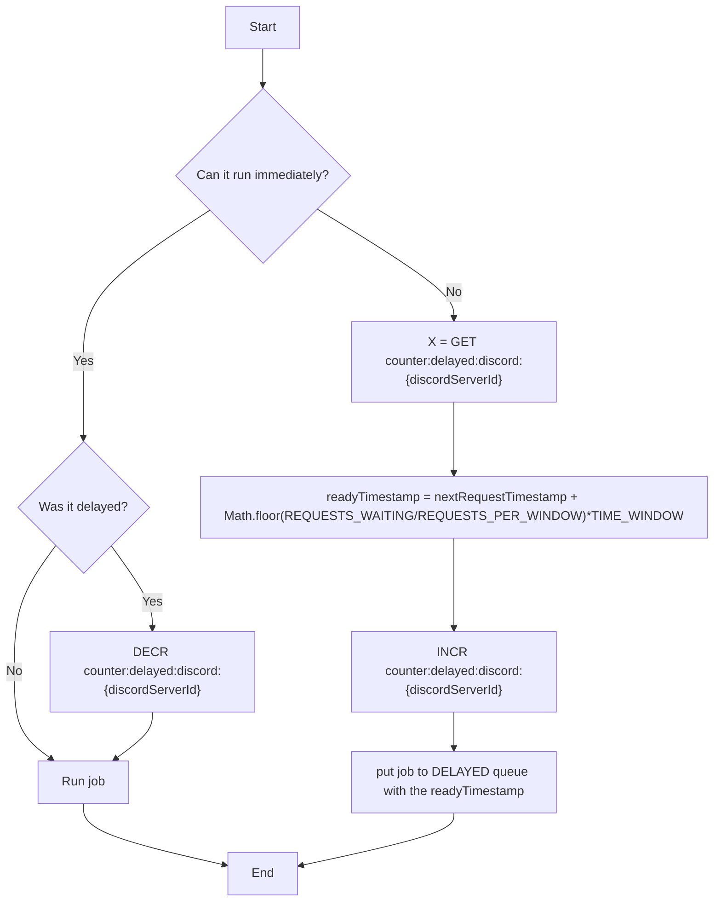

## Discord delay

We can make 10 member role update requests per 10 seconds to Discord.
Bottleneck.js can ensure that we only send 10 requests in every 10 seconds, and it can also tell us if a request was added right now would it run immediately. If it wouldn't run immediately bottleneck can tell us the next request timestamp (the start of the next 10 second time window). So if we know the next time windows and how many requests are waiting for execution we can estimate the timestamp when the new request will be ready to execute:  `readyTimestamp = nextRequestTimestamp + Math.floor(REQUESTS_WAITING/REQUESTS_PER_WINDOW)*TIME_WINDOW`  
(we basically estimate the start of the time window when the request can be executed, note: request can be executed _concurrently_)

