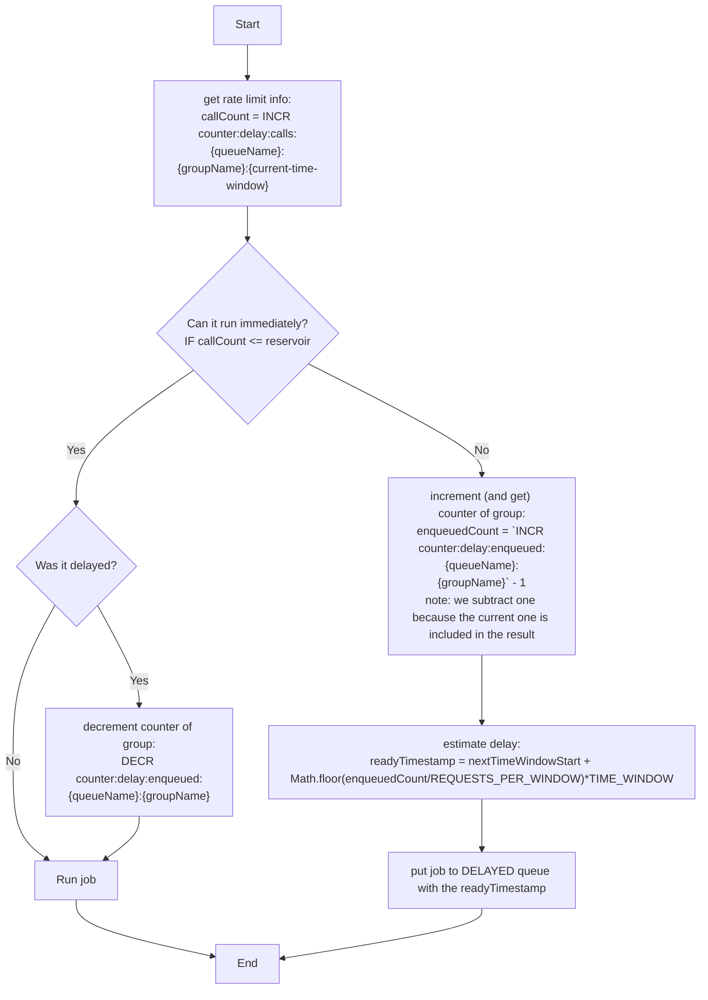

## Rate limiting

Sometimes we can't execute the upcoming jobs immediately because a rate limit was hit. For example in case of Discord we can make 10 member role update requests per 10 seconds to Discord.

### The idea

We should keep track of these rate limits, and should not even execute the jobs if we know it would be rate limited.
We can do this by defining time windows and the reservoir, e.g. 10 second is the time window and 10 is the reservoir for the example above. We will also need to store the current number of calls in the curren time windows. Every time a job is executed we update these values.
For the delay logic we use another queue a "delayed queue" in which we will put a job that we delay. Because the Discord rate limit is per server, and all the delayed jobs will go to a single delayed queue, we should also store a counter for the number of jobs of each "delayed group" ~ e.g. this Discord server has this many delayed jobs.

So if we know the how many request do we have in the current time window and how many jobs are waiting for execution we can estimate the timestamp when the new request will be ready to execute:

- if we can make a call in the current time windows, we can run the job right away
- if we can't then the estimation is: 
  `readyTimestamp = nextTimeWindowStart + Math.floor(REQUESTS_WAITING/REQUESTS_PER_WINDOW)*TIME_WINDOW`  
  (we basically estimate the start of the time window when the request can be executed, note: request can be executed _concurrently_)

### Extra keys

- `counter:delay:calls:<queueName>:<groupName>:<current-time-window>`
  - the rate limit info
  - value: number of calls in the current time window
  - `current-time-window`: `⌊ timestamp / time-window ⌋` 
    (floor of the timestamp divided by the length of the time window)
- `counter:delay:enqueued:<queueName>:<groupName>`
  - counter for delayed jobs per group

### Flow chart

