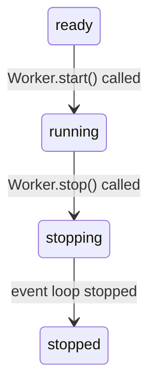
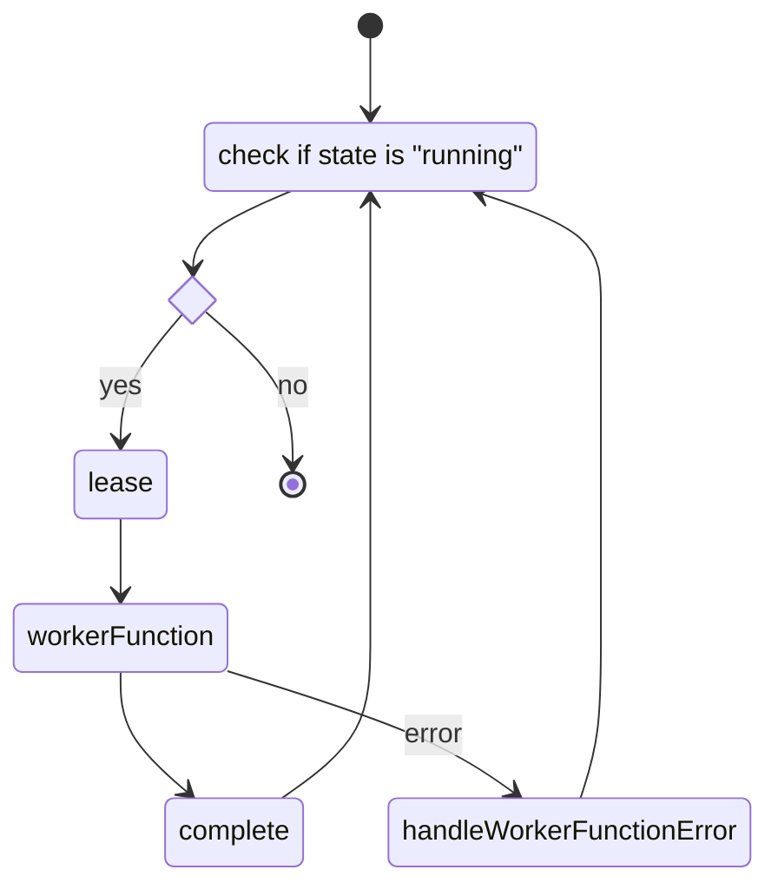

## Workers

The workers are responsible for the job execution, they're by far the most complex entities in this library.

### Starting/stopping the worker

- Starting and stopping the worker is usually done by the flow they belong to.
- The `Worker.start()` method will set the status to `"running"` and start the event loop.
- The `Worker.stop()` method will set the status to `"stopping"` thus gives a sign to the event loop to stop. Then it will wait until the loop is finished and set the status to `"stopped"`.
- When the worker's status is no longer `"running"`, it will finish the execution.

### Event loop ~ the job execution process

- The worker's event loop is a function running in an "infinite" loop and executes jobs synchronously, one after another.

#### lease

- first a **job is leased, meaning it will be marked for execution and cannot be picked up by other workers**
- The `BLMOVE` method is used to move a job from the waiting queue to the processing queue
  - it's blocking, so if there's no job in the waiting queue, it will block the code execution until one appears
    - we set a timeout for the `BLMOVE` so the event loop can be easily stopped: the `BLMOVE` will wait some seconds for a job, if there's none, it returns null and the worker's status is re-checked before the next `BLMOVE`
    - the waiting timeout can be set in the worker's constructor
  - if the `BLMOVE` is successful, the job is marked for execution and no other worker will be able to pick it up
  - it returns the moved job's id
  - `BLMOVE queue:<queueName>:waiting queue:<queueName>:processing <timeout>`
- now a lock key is inserted for this queue and job (with a TTL), which means the job is under execution
  - after the lock key expires the job is considered failed (worker timeout)
  - this makes sure that no job can get stuck in the queues "forever"
  - `SET lock:<flowName>:<jobId> <workerId> EX <lockTimeSec>`
- finally the job's relevant properties in this queue (defined in Queue.attributesToGet) are fetched by its ids
  - `HGET job:<flowName>:<jobId> property1 property2`

### workerFunction

- after the lease method returned the (partial) job, it's passed to the `workerFunction`
- **the worker function's body is defined by the user**
- it takes the job as a parameter and returns a pre-defined result type
  - the `nextQueue` property of the result can determine where the job will be put when it's completed

### complete

- finally the `complete` method will be called with the job's id and the result (returned by the `workerFunction`)
- it will save the `workerFunction`'s result to the job's hash, and optionally put the job to the next queue
- first it checks if there's a lock for this job
  - `GET lock:<queueName>:<jobId>`
  - if not, it won't do anything
  - otherwise
    - sets the result to the job's hash
      - `HSET job:<flowName>:<jobId> resultKey resultValue ...`
    - also sets the "completed-queue" property to the current queue
      - `HSET job:<flowName>:<jobId> completed-queue <thisQueue>`
    - then in a transaction (to minimize the chance of inconsistency):
      - if there's a `nextQueue` property, the job's id is put to the next waiting queue
        - `RPUSH queue:<nextQueue>:waiting <jobId>`
      - the job's id is removed from the current queue
        - `LREM queue:<thisQueue>:processing 1 <jobId>`
      - finally the lock is deleted
        - `DEL lock:<thisQueue>:<jobId>`
    - finally there's an error checking & fixing mechanism
      - both `LREM` and `DEL` returns the number of removed elements
      - if the `LREM` returns a 0 value, it means the job was not present in the current processing, thus the completion was invalid
        - in this case an inconsistency happened (the job was moved from the processing queue by another entity) and we put an "invalid" job to a next queue (probably duplicated it)
        - to fix it we try to remove the job from next queue where we put it before (this will only work if the job is not instantly picked up by the next worker)

### handleWorkerFunctionError

- if an uncaught exception is thrown in the `workerFunction` the `handleWorkerFunctionError` method will be called with the job's id and the error object
- it will
  - log the error
  - set the job's `done` property to "true"
    - `HSET job:<flowName>:<jobId> done true`
  - set the `failed` property to "true"
    - `HSET job:<flowName>:<jobId> failed true`
  - set the `failedQueue` property to current queue's name
    - `HSET job:<flowName>:<jobId> failedQueue <queueName>`
  - set the `failedErrorMsg` property to the error message
    - `HSET job:<flowName>:<jobId> failedErrorMsg <errorMsg>`
  - remove the job from the processing queue
    - `LREM queue:<thisQueue>:processing 1 <jobId>`
